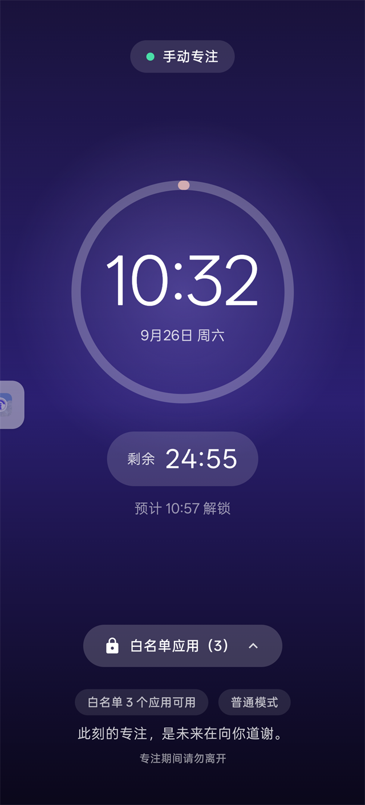
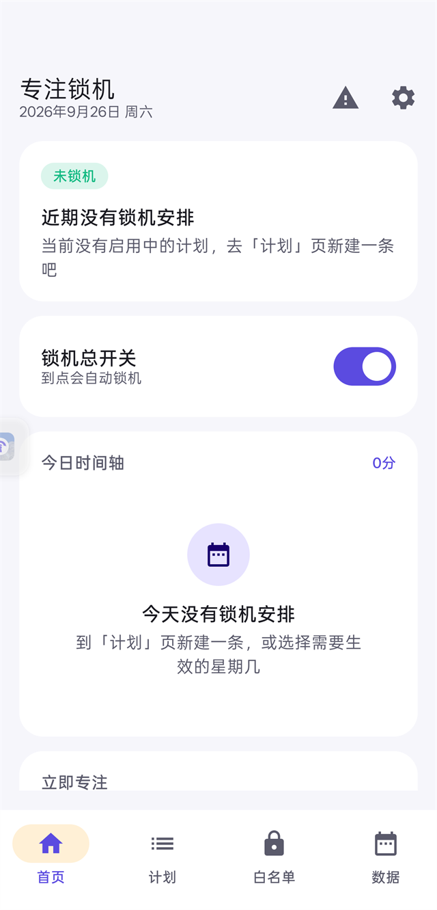
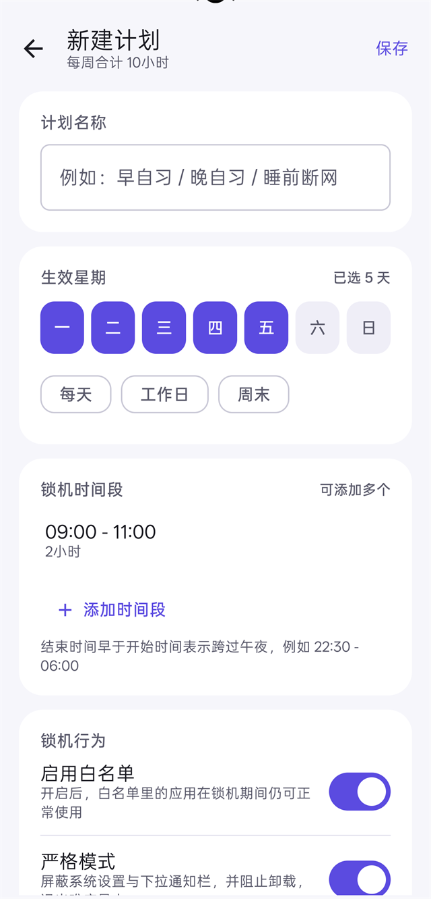

# 专注锁机 FocusLock

[](LICENSE)
[](#二安装)
[](../../releases)

**[English](README.en.md)** · **简体中文**

**按星期几 + 时间段强制锁机的安卓专注工具：可选白名单，完全离线，没有网络权限。**

An Android app locker for focused study — schedule-based whitelisting, reboot-proof
timers, and **no network permission at all**. MIT licensed.

> 面向的场景很具体：考研 / 备考期间，某些时间段必须把手机变成一块砖，
> 只留下少数几个学习类应用可用。

<p align="center">
  
  
  
</p>

**[⬇ 下载安装包](../../releases/latest)** · **[权限说明](#四权限都是干什么用的)** · **[抗绕过设计](#五锁机是怎么做到赖不掉的)**

---

## 一、它能做什么

| 能力 | 说明 |
| --- | --- |
| 多条锁机计划 | 想建几条建几条，每条独立启用 / 停用 |
| 每天多个时间段 | 一条计划里可以加任意多个起止时间，支持跨午夜（22:30 - 06:00） |
| 按星期生效 | 每条计划自己选每周哪几天生效，另有一键「每天 / 工作日 / 周末」 |
| 可选白名单 | 白名单里的应用锁机期间照常使用；也可以关掉白名单，除系统必需应用外全拦 |
| 锁屏直接启动白名单应用 | 锁屏底部有「白名单应用（N）」按钮，点开就是可用的应用列表，点一下直接打开，按 Home 回到锁屏 |
| 白名单覆盖全部应用 | 可选范围是系统里除本应用外的**所有**已安装应用，含没有桌面图标的系统应用 |
| 屏蔽 AI 助手规避 | 长按电源键唤起小布（或其他 AI 助手）再让它替你开应用这条路被堵死 |
| 普通 / 严格两种模式 | 严格模式额外屏蔽系统设置与下拉通知栏，并阻止卸载 |
| 自选锁屏图片 | 从相册挑任意图片当锁机背景，自动裁切铺满 |
| 锁屏显示时间 | 大字时钟 + 进度环 + 剩余倒计时 + 预计解锁时间 |
| 不影响开关机 | 电源键完全不拦截，长按照样弹出电源菜单，正常关机 / 重启 |
| 重启不会提前结束 | 会话时长写在磁盘上，开机后自动恢复并接着走完剩余时间 |
| 到点自动退出 | 时间一到自动解锁并通知，不用手动干预 |
| 记录锁机总时长 | 今日 / 本周 / 本月 / 累计，近 7 天柱状图，每一次锁机明细 |
| 权限集中申请 | 权限中心逐项检测、逐项跳转，缺哪项一目了然 |
| 精简 UI | Material 3 + Compose，深浅色主题，底部四页签 |
| 中英双语 | 默认跟随系统语言；也可在「设置 → 语言」里单独指定，或走 Android 13 的「应用语言」系统设置 |

---

## 二、安装

已经编译好的安装包在 `dist/` 目录：

| 文件 | 大小 | 说明 |
| --- | --- | --- |
| `FocusLock-1.0.0-release.apk` | 2.4 MB | **推荐安装这个**。已开启 R8 压缩混淆，用项目内自带的证书签名 |
| `FocusLock-1.0.0-debug.apk` | 13 MB | 调试包，含完整调试符号，排查问题时用 |

用数据线或微信传到手机，点击安装。系统提示「未知来源应用」时允许即可。

**首次打开请务必走完「权限中心」**，尤其是前两项：

1. **无障碍服务（应用监视）** —— 拦截功能的核心，不开等于没锁
2. **悬浮窗权限** —— 安卓 10 以后禁止应用在后台自己弹界面，没有这个权限锁机到点不会自动全屏弹出

---

## 三、快速上手

1. 打开 App → 底部「计划」→ 右下角 `+`
2. 起个名字，比如「早自习」
3. 选生效的星期几
4. 添加时间段，比如 `07:00 - 08:30`
5. 决定要不要开白名单、要不要严格模式
6. 保存 → 回首页，能看到「距下次锁机」的倒计时

想先试一下效果，首页有「立即专注」的 25 / 45 / 60 / 90 分钟快捷按钮。

白名单在底部「白名单」页配置：搜索、勾选即可，被选中的应用锁机期间能正常打开。

---

## 三之二、中英双语

界面支持中文和英文：

- **默认跟随系统语言** —— 系统是中文就显示中文，其他情况显示英文
- **也可以在应用内单独指定** —— 设置 → 语言 → 跟随系统 / 简体中文 / English
- **Android 13 及以上**还能在「系统设置 → 应用 → 专注锁机 → 语言」里切换

所有文案都在 `app/src/main/res/values/`（英文，同时作为兜底）和 `values-zh/`（中文）两份资源里。
想加第三种语言，复制 `values-zh/` 改成对应语言代码再翻译即可。

> 你自己的数据（计划名、锁屏文案）不会被翻译——那是你写的东西，不是界面。

---

## 四、权限都是干什么用的

| 权限 | 必需性 | 用途 |
| --- | --- | --- |
| 无障碍服务 | **必需** | 读取「当前前台是哪个应用」，锁机期间把白名单外的应用弹回锁屏。**不读取任何屏幕内容**（配置里 `canRetrieveWindowContent=false`） |
| 悬浮窗 | **必需** | 绕过安卓 10+ 的后台启动界面限制，锁机到点自动全屏弹出 |
| 通知 | **必需** | 常驻通知显示剩余时间；到点提醒 |
| 精确闹钟 | **必需** | 到点准时开始 / 准时结束 |
| 忽略电池优化 | **必需** | 防止锁机服务被系统在后台冻结 |
| 使用情况访问 | 可选 | 无障碍之外的兜底判定 |
| 设备管理员 | 可选 | 锁机期间阻止卸载 / 强行停止 |
| 列出已安装应用 | 自动 | 用于生成白名单列表 |

**这个应用完全离线**，没有任何网络权限，不联网、不上传、不收集任何数据。所有判断都在本机完成。

---

## 五、锁机是怎么做到「赖不掉」的

这是整个项目最费心思的部分。想绕过的常规手段无非几种，逐条对应：

### 1. 把系统时间往后调，让倒计时瞬间走完

倒计时同时用两个时钟算，取**较大值**：

- **墙钟**：`开始时刻 + 时长 - 现在几点`
- **单调时钟**：`时长 - (elapsedRealtime() - 开始时 elapsedRealtime())`

`elapsedRealtime()` 只随真实时间流逝增长，改系统时间对它毫无影响。你把时间调到 2030 年，墙钟那一项直接变成负数，但单调时钟那一项纹丝不动，锁机照旧。

### 2. 把系统时间往前调，让「结束时刻」看起来还没到……或者反过来坑自己

如果墙钟剩余比单调时钟剩余多出 90 秒以上（说明时间被往回拨了），程序会**以单调时钟为准重建基线**，不会因为时间被拨回去而无谓地延长锁机。

### 3. 重启手机

锁机开始时就把**总时长**这个数字写进磁盘，同时记下当时的墙钟时刻和单调时刻。重启后 `elapsedRealtime()` 归零，程序检测到这一点，就用墙钟剩余量重建基线，接着走完剩下的时间。

另外还会参考「历史观测到的最大墙钟时刻」来抵消「重启 + 把时间往回拨」这种组合拳（允许 1 小时误差，照顾跨时区飞行这类正常场景）。

配合 `BOOT_COMPLETED` 广播，开机后锁机服务会被自动拉起，锁屏界面立刻回来。

### 4. 从最近任务划掉 / 让系统杀掉后台

- 前台服务 + `START_STICKY`
- 每分钟一次的 `AlarmManager` 心跳闹钟（`setExactAndAllowWhileIdle`），进程被杀后由它叫醒
- `onTaskRemoved` 里立刻重排心跳，从最近任务划掉的下一秒就回来

### 4.5 长按电源键唤起 AI 助手，让助手替你打开应用

一加 / OPPO 的「小布助手」可以直接被电源键唤起，再让它打开微信或系统设置——
这是本地锁机软件最容易被绕过的一条路，而且电源键本身绝不能拦（拦了就没法关机重启）。

做法是：**电源键不拦，但把助手类应用全部列入「无论如何都拦」名单**，并且这个名单
的优先级高于电源键宽限期。已经在真机上验证：

```
AppWatchService: 拦截（不可放行）com.heytap.speechassist
```

被列入该名单的还有各家桌面（否则按 Home 就跑了）、Google 助手。白名单里也能选到
它们，但界面上会明确标注「锁机时仍拦住」，避免用户以为设了没用。

### 4.6 本应用自己的主界面跑到前台

修这条之前有个真实漏洞：无障碍服务对自己整个包名一律放行，于是「从最近任务切回
主界面」就能在锁机期间正常使用手机。现在的规则是——**只有锁屏界面能待在前台**，
跑上来的是主界面就立刻顶回去：

```
AppWatchService: 本应用的非锁屏界面出现在前台（com.focuslock.app.ui.MainActivity），顶回锁屏
```

注意只对「本应用自己的 Activity 类名」下手：锁屏上的白名单对话框是独立窗口
（className 是 `android.widget.FrameLayout` 之类），必须放行，否则弹窗会把自己顶掉。

### 4.7 从锁屏启动白名单应用时被系统确认框掐断

点白名单应用后，ColorOS 会先弹一个自己的「确认启动 / 授予权限」框。它不属于白名单，
照拦的话应用永远打不开——实测日志里能看到：

```
START u0 {... pkg=com.microsoft.emmx ...} result code=0     ← 应用确实被启动了
AppWatchService: 拦截 com.oplus.securitypermission           ← 但系统确认框被我拦掉
```

修法是两处：系统的权限/安装/确认框加入常驻放行名单；另外从锁屏点开应用时开一个
10 秒的**发射宽限期**，让系统跟着弹出来的框能正常显示。

### 5. 锁机期间把无障碍服务关掉

严格模式下「系统设置」被屏蔽，进不去那个开关页面。真要绕过去，只能去系统设置里先关掉无障碍——但锁机服务每 15 秒自检一次，一旦发现无障碍断了会立刻发通知提醒。

### 6. 卸载 App

需要设备管理员权限（权限中心里可选开启）。开启后锁机期间 `setUninstallBlocked` 生效，卸载入口会被系统拦下。撤销设备管理员本身要走系统设置，同样被严格模式挡住。

### 7. 到点不结束（反向耍赖）

结束时刻用 `setAlarmClock` 下发，可以穿透 Doze、时间精确，到点必然触发。

### 8. 到点不开始 / 开始得晚

**这是在一加 Ace 6（ColorOS 16 / Android 16）实测踩出来的坑，值得单独说。**

一开始开始/结束都用 `setExactAndAllowWhileIdle`。实测发现结束是准点的，**开始却晚了 70 秒**。
翻 `dumpsys alarm` 看到：

```
Alarm{... com.focuslock.app} windowLength 69111     ← 开始闹钟：带 69 秒窗口
Alarm{... com.focuslock.app} windowLength 0         ← 结束闹钟：精确
```

原因是 ColorOS 把 `setExactAndAllowWhileIdle` 降级成了**带窗口的批处理闹钟**，
`WINDOW_HEURISTIC` 的窗口大小跟「距离目标还有多久」相关——离得越远窗口越大，
排到 24 小时之后直接被封顶成 1 小时。而 `setAlarmClock` 下发的「闹钟式」条目
系统不做批处理，所以是准的。

修法：**开始和结束都改用 `setAlarmClock`**。代价是状态栏会出现一个闹钟图标
（系统把下一次锁机当成用户闹钟展示）。为了不让这个图标整天挂着，只在
「距开始不足 30 分钟」时才升级成闹钟式下发，更早的时候先排一个「预备闹钟」，
到提前 30 分钟那一刻再自我升级。改完后 `windowLength 0`，实测准点。

> 如果你在别的机型上发现锁机仍然不准时，大概率是同一个原因：
> 用 `adb shell dumpsys alarm | grep -A2 focuslock` 看 `windowLength`，
> 是 0 才代表精确。

### 顺带一提：电源键和开关机

**电源键从不拦截。** 无障碍服务只记录电源键按下的时刻，并在此后 8 秒内暂停一切拦截——这段时间正好够系统电源菜单弹出来。所以长按电源键关机和重启是完全正常的，锁机只是「重启后还会回来」而已。

---

## 五之二、在一加 Ace 6 上的实测记录

以下都是在真机（一加 Ace 6 / ColorOS 16 / Android 16 / API 36）上跑出来的，不是推测：

| 验证项 | 结果 |
| --- | --- |
| 安装、冷启动 | 通过，283 ms，无崩溃 |
| 首页 / 计划列表 / 计划编辑 / 权限中心 / 白名单 渲染 | 通过 |
| 权限状态检测（无障碍、悬浮窗、精确闹钟、电池优化） | 通过，与实际状态一致 |
| 立即专注（手动锁机） | 通过，锁屏弹出、时钟与倒计时正常走动 |
| 拦截 Home 键 | 通过，锁屏保持在前台 |
| 拦截白名单外应用（微信、浏览器） | 通过，日志 `AppWatchService: 拦截 com.heytap.browser` |
| 前台服务 + 常驻通知 + 通知渠道 | 通过 |
| 计划保存（星期多选、时间段、预览时长） | 通过 |
| 到点自动开始 | 通过（修复 `setAlarmClock` 后精确） |
| 到点自动退出 | 通过，准点 |
| 无障碍服务绑定 | 通过（`dumpsys accessibility` 可见已绑定） |
| 锁屏「白名单应用」按钮 → 打开 Edge | 通过，前台变为 `com.microsoft.emmx` |
| 打开白名单应用后按 Home | 通过，弹回锁屏 |
| 强制把主界面拉到前台（模拟绕过） | 通过，被顶回锁屏 |
| 强行唤起小布助手 `com.heytap.speechassist` | 通过，被拦下 |
| 白名单列出全部应用（512 个，含系统应用） | 通过 |
| 新建计划默认无时间段、时间选择器初值 00:00-00:00 | 通过 |

尚未在真机上验证的部分：重启后恢复、自选锁屏背景图、紧急解锁密码、
严格模式下屏蔽系统设置与通知栏。这几项的逻辑都由单元测试覆盖，但没有真机跑过。

### 一个已知的体验短板

非严格模式给「提前结束锁机」留的出口在**常驻通知**里。但系统要求通知展开后才显示
按钮（`setShowActionsInCompactView` 是 `MediaStyle` 独有的 API，普通通知用不了），
在一加 Ace 6 上试了多种手势都没能把按钮展开出来 —— 也就是说这个出口实际上不太好用。

严格模式本来就不该有出口，所以影响有限；但如果你打算用非严格模式的定时计划，
请把这个当成「基本退不出来」来安排。真锁死了的兜底手段：数据线连电脑执行
`adb uninstall com.focuslock.app`。

---

## 六、已知局限（写在明面上）

1. **关机期间的时间算不算锁机** —— 算。手机都关了，本来也用不了。重启后按墙钟恢复剩余时间。
2. **重启 + 改时间** 这一组合，在纯本地、不联网的前提下无法百分之百识别。上面提到的「最大墙钟时刻」水位线能挡住往回拨，但如果把时间往后调再重启，程序只能相信系统时间。要彻底解决需要服务端对时，这超出了「一个本地 App」的范围。
3. **不同品牌手机的后台策略** —— 小米 / 华为 / OPPO / vivo 等还有自家的「自启动」「后台冻结」开关，需要在系统设置里额外允许，锁机才会稳定。权限中心底部有提示。
4. **紧急解锁密码忘了就没了** —— 密码存在本机，没有找回途径，只能等锁机结束。留空表示不提供任何中途退出方式。
5. **出厂恢复** —— 谁都挡不住恢复出厂设置，这是物理层面的后门，任何本地锁机软件都一样。

---

## 七、自己编译

### 环境

- JDK 17
- Android SDK（platform 34 + build-tools 34.0.0）
- Gradle 8.7

本机 `local.properties` 里的 SDK 路径写成你自己的：

```properties
sdk.dir=D:\\Android\\sdk
```

### 命令

```bash
# 调试包（可直接安装，用默认调试签名）
./gradlew assembleDebug

# 发布包（用项目里的 focuslock.keystore 签名）
./gradlew assembleRelease

# 跑核心逻辑的单元测试（24 个用例）
./gradlew testDebugUnitTest
```

### 三个已经踩过的坑

**1. Gradle 下载源**

`gradle/wrapper/gradle-wrapper.properties` 里的地址指向腾讯云镜像
（`https://mirrors.cloud.tencent.com/gradle/gradle-8.7-bin.zip`），
因为 Gradle 官方源会重定向到 GitHub，国内直连经常超时。能直连的话可以换回
`https://services.gradle.org/distributions/gradle-8.7-bin.zip`。

**2. 不要在 `org.gradle.jvmargs` 里加 `-Dfile.encoding=UTF-8`**

中文 Windows 的系统 ANSI 代码页是 GBK。Gradle 在 UTF-8 下写出的测试 worker
参数文件会被 JVM 按 GBK 解析，路径乱码后直接报
`ClassNotFoundException: worker.gradle.process.internal.worker.GradleWorkerMain`。
Kotlin 源码本来就默认按 UTF-8 编译，不需要这个开关。`gradle.properties` 里已经写了注释。

**3. 工程路径含中文时单元测试跑不起来**

`assembleDebug` / `assembleRelease` 在中文路径下没问题（`android.overridePathCheck=true`
已经打开），但 `testDebugUnitTest` 的 worker 进程仍然会因为路径编码崩掉。
如果单元测试报 `GradleWorkerMain` 找不到，把工程复制到纯英文路径再跑即可：

```bash
cp -r focus-lock /d/fl && cd /d/fl && ./gradlew testDebugUnitTest
```

### 发布签名的密钥

项目自带一个测试用密钥 `app/focuslock.keystore`，口令全部是 `focuslock`。
自己长期使用建议换成自己的密钥：

```bash
keytool -genkeypair -v -keystore my.keystore -alias mykey \
  -keyalg RSA -keysize 2048 -validity 10950
```

然后改 `app/build.gradle.kts` 里的 `signingConfigs`。

---

## 八、代码结构

```
app/src/main/java/com/focuslock/app/
├── FocusLockApp.kt              每个进程启动都要跑的初始化 + 状态恢复
├── data/
│   ├── Models.kt                TimeRange / Schedule / LockWindow / LockSession
│   ├── Prefs.kt                 全部持久化状态（SharedPreferences + JSON）
│   ├── StatsStore.kt            锁机时长统计
│   └── AppCatalog.kt            已安装应用列表（白名单数据源）
├── logic/
│   ├── ScheduleEvaluator.kt     计划 → 具体锁机区间；跨午夜、多计划重叠合并
│   ├── LockController.kt        ★ 总调度 + 双时钟抗篡改倒计时
│   ├── LockRuntime.kt           进程内锁机状态（给无障碍服务快速读取）
│   ├── AlarmScheduler.kt        开始 / 结束 / 心跳三类闹钟
│   ├── ServiceLauncher.kt       前台服务启停 + 震动
│   └── FocusAdmin.kt            设备管理员能力
├── service/
│   ├── LockService.kt           锁机常驻前台服务（每秒 tick）
│   ├── AppWatchService.kt       ★ 无障碍服务：拦截白名单外的前台应用
│   ├── AlarmReceiver.kt         闹钟统一入口
│   ├── BootReceiver.kt          开机 / 改时间后的恢复
│   └── FocusDeviceAdminReceiver.kt
├── ui/
│   ├── MainActivity.kt          底部四页签 + 覆盖页导航
│   ├── AppViewModel.kt          全部界面状态
│   ├── LockActivity.kt          锁机界面（全屏、置顶、吞返回键）
│   ├── LockScreen.kt            锁屏视觉：背景图 / 进度环 / 时钟 / 倒计时
│   ├── screens/                 首页 / 计划列表 / 计划编辑 / 白名单 / 数据 / 设置 / 权限中心
│   ├── components/Common.kt     复用组件
│   └── theme/Theme.kt           配色与字体
└── util/
    ├── Fmt.kt                   时间格式化
    ├── Notifications.kt         通知渠道与各类通知
    └── Permissions.kt           权限检测与跳转

app/src/main/res/xml/
├── accessibility_service_config.xml   无障碍服务声明
└── device_admin.xml                   设备管理员策略声明

app/src/test/java/com/focuslock/app/
├── CountdownTest.kt             7 个用例：双时钟倒计时在各种改时间/重启场景下的行为
└── ScheduleEvaluatorTest.kt     17 个用例：跨午夜、多计划重叠、已完成去重、周合计
```

### 测试覆盖了什么

`CountdownTest` 就是「重启 / 改时间都不能让锁机提前结束」这句话的可执行版本：

- 正常流逝 → 按墙钟给出剩余
- 把系统时间往后拨 3 小时 → 仍按单调钟算，还剩 110 分钟
- 把系统时间往回拨 5 小时 → 触发基线重建，按单调钟重算，不会把锁机拖长
- 30 秒的正常漂移 → 不误判
- 重启（单调钟归零）→ 按墙钟恢复剩余时间
- 重启 + 回拨 10 小时 → 被墙钟水位线兜住
- 时间走完 → 返回 0 而不是负数

`ScheduleEvaluatorTest` 覆盖时段换算：跨午夜落次日、停用计划不生效、
多计划重叠时结束时间取最晚且严格模式取或、已完成的区间被排除、
下一时段查找、今天的时间轴、周合计分钟数。

---

## 九、安装包

仓库里**不含 APK**（构建产物不进版本库）。安装包发布在
[Releases](../../releases) 页面：下载 `FocusLock-1.0.0-release.apk` 传到手机上安装即可。

如果你是自己 clone 下来编译，`./gradlew assembleRelease` 的产物在
`app/build/outputs/apk/release/`。仓库里没有附带签名密钥，
所以默认会用调试签名——自己长期使用请换成自己的密钥（见上一节）。

## 十、技术栈

- Kotlin 2.0.20 / Jetpack Compose（BOM 2024.09.02）/ Material 3
- minSdk 26（Android 8.0），targetSdk 34
- 零网络依赖，全部数据在本机 SharedPreferences
- 主要依赖：`androidx.core`、`activity-compose`、`lifecycle-*`、`compose ui/material3`、`coil-compose`（加载锁屏背景图）

## 十一、许可

MIT License，见 [LICENSE](LICENSE)。

这个项目是为了自己考研备考好用才写的，欢迎随意取用、修改、二次分发。
唯一的请求是：**别拿它去做伤害使用者的事**——锁机软件天然带着强制属性，
用它把别人的手机锁死不是这个项目存在的目的。
